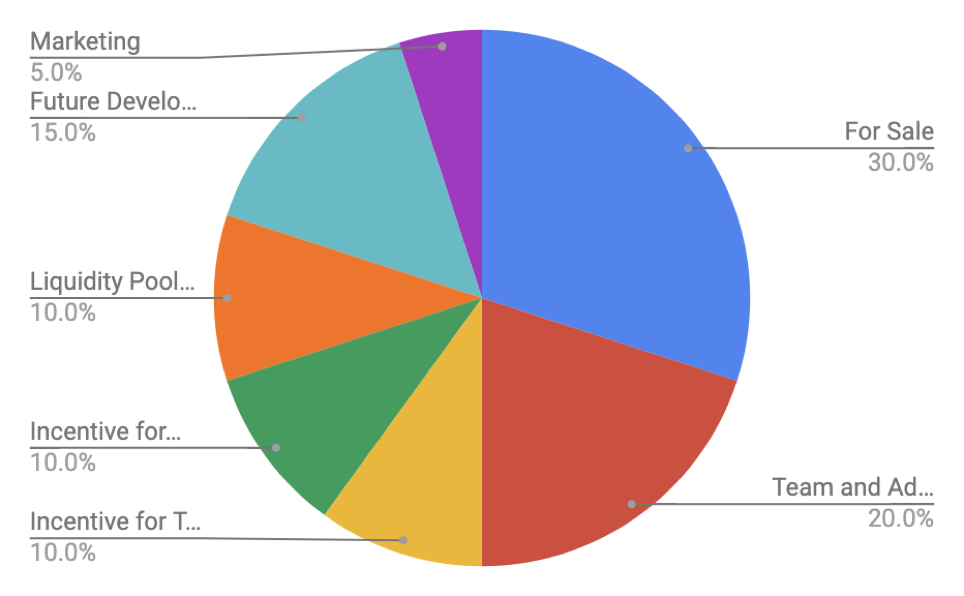

# Moret Tokenomics

The fundamental principal of Moret tokenomics is to align economics with value creations. Therefore, it is designed as a blend of fixed and inflationary supply.

Initially, the Moret token starts with 100 million fixed supply allocating to the following

<figure><figcaption>
Moret Tokenomics at the initial stage
</figcaption></figure>

Protocol fees from options expired in the money are accumulated in Moret reserve, which is the Moret token address. Moret tokens can be burned in exchange for USDC in reserve which returns the protocol fees to the holders.&#x20;

Once a liquidity pool reaches $1m TVL, the holders of the liquidity pool can exchange their LP tokens with Moret, hence transferring an ownership of a single pool to the whole protocol. In return, the holders will be able to receive not only the yield from previous pool, but the protocol fees from all pools as well as participating in the protocol governance.

